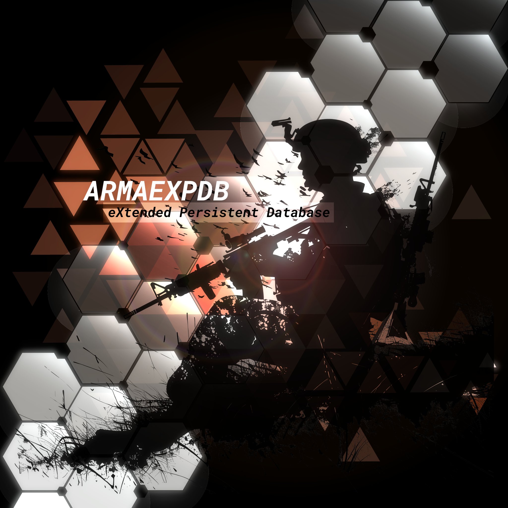

# eXtended Persistent DB

	
		
	

## Description

eXtended Persistent DB is the mod version of [Arma Persistent Core System](https://github.com/NikolaiF90/ArmaPersistentCoreSystem)

## Features

- Persist vehicle position, rotation, crew, turret and etc.
- Persist player units alongside team member.
- Persist environment information like overcast, date and time.
- Persist all map markers including player placed markers.
- Configure mod to save according to your preferences

## Installation

- Download the latest release from the [releases](https://github.com/jschmidt92/eXtendedPersistentDB/releases) page.
- Extract @xpdb from the zip file and paste it into your Arma 3 folder and activate it within the Arma 3 Launcher.

## Usage

- Open 3DEN Mission Editor.
- If you already have an init.sqf and an initPlayerLocal.sqf, paste the following into the init.sqf   `Scenario_Name = "NameOfYourScenario";` and then `[] call xpdb_db_fnc_init;` into the initPlayerLocal.sqf.
- From here you are pretty much done. You don't need to edit anything else.
- Start the mission and use mouse scroll wheel to reveal the save action.
- If you want to implement your own save configuration check out the `missionTemplate` to see how it's done.

$${\color{red}Important: \space Please \space read \space this \space message \space carefully!}$$
 _eXtended Persistent DB_ saves/loads everything via `hashMaps`, for more info on `hashMaps` check out the [BIS Wiki](https://community.bistudio.com/wiki/HashMap)

## Contributing

- Fork the repository.
- Create a branch for your changes.
- Create a pull request.

## License

With this license you are free to adapt (i.e. modify, rework or update) and share (i.e. copy, distribute or transmit) the material under the following conditions:

- Attribution - You must attribute the material in the manner specified by the author or licensor (but not in any way that suggests that they endorse you or your use of the material).
- Noncommercial - You may not use this material for any commercial purposes.
- Arma Only - You may not convert or adapt this material to be used in other games than Arma.
- Share Alike - If you adapt, or build upon this material, you may distribute the resulting material only under the same license.

## Credits

- [NikolaiF90 (PrinceF90)](https://github.com/NikolaiF90)
- [Sukhoi191](https://gitlab.com/sukhoi191)
- [Jacob Schmidt](https://github.com/jschmidt92)
